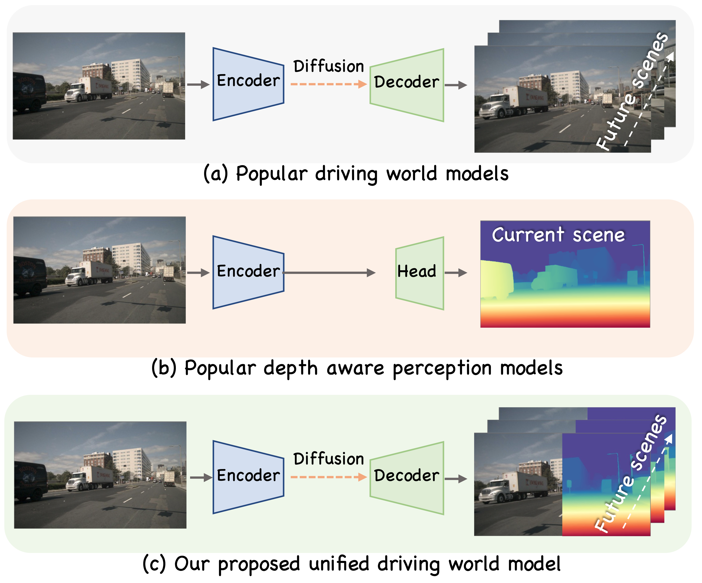
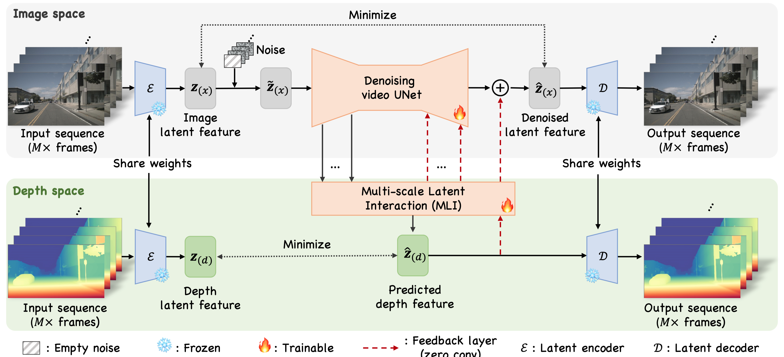
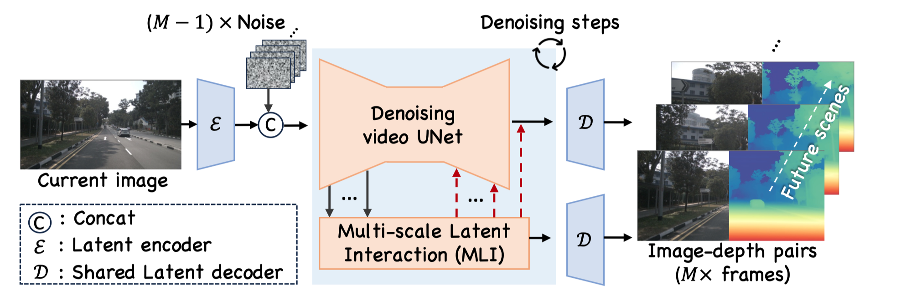
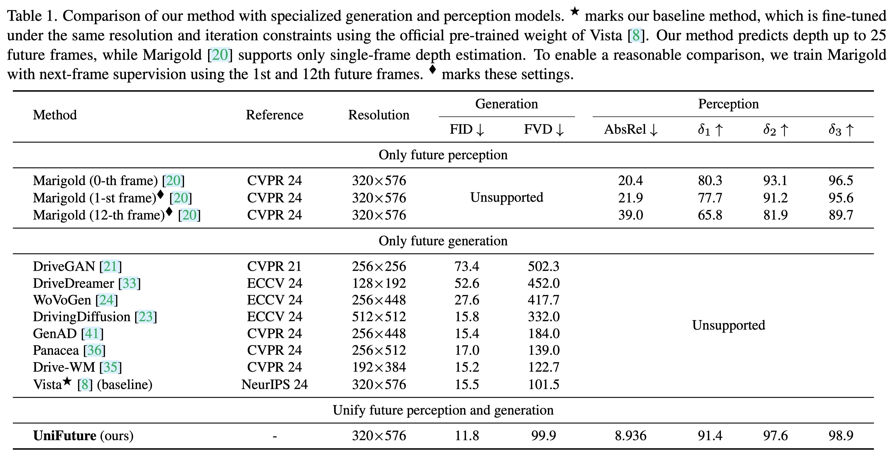

<div align="center">
<h3>Seeing the Future, Perceiving the Future: A Unified Driving World Model for Future Generation and Perception</h3>


[Dingkang Liang](https://dk-liang.github.io/)<sup>1</sup>, [Dingyuan Zhang](https://scholar.google.com/citations?user=H_nRYBQAAAAJ&hl=en)<sup>1</sup>, [Xin Zhou](https://lmd0311.github.io/)<sup>1</sup>,  Sifan Tu<sup>1</sup>, Tianrui Feng<sup>1</sup>,   
Xiaofan Li<sup>2</sup>, Yumeng Zhang<sup>2</sup>,  Mingyang Du<sup>1</sup>, Xiao Tan<sup>2</sup>, [Xiang Bai](https://scholar.google.com/citations?user=UeltiQ4AAAAJ&hl=en)<sup>1</sup>

<sup>1</sup>  Huazhong University of Science & Technology, <sup>2</sup>  Baidu 

[](https://arxiv.org/abs/2503.13587)
[](https://dk-liang.github.io/UniFuture/)
[](https://huggingface.co/H-EmbodVis/UniFuture)
[](https://github.com/tatsu-lab/stanford_alpaca/blob/main/LICENSE)

Check our *awesome* for the latest World Models! [](https://github.com/LMD0311/Awesome-World-Model)


</div>

## 📣 News

- **[2026.01]** UniFuture is accepted by ICRA 2026!
- **[2025.07]** Release the training, inference, and evaluation code.
- **[2025.03]** Release the demo. Check it out and give it a star 🌟!
- **[2025.03]** Release the [paper](https://arxiv.org/abs/2503.13587).

 <div  align="center">    
 
</div>


## Abstract

We present UniFuture, a simple yet effective driving world model that seamlessly integrates future scene generation and perception within a single framework. Unlike existing models focusing solely on pixel-level future prediction or geometric reasoning, our approach jointly models future appearance (i.e., RGB image) and geometry (i.e., depth), ensuring coherent predictions. Specifically, during the training, we first introduce a Dual-Latent Sharing scheme, which transfers image and depth sequence in a shared latent space, allowing both modalities to benefit from shared feature learning. Additionally, we propose a Multi-scale Latent Interaction mechanism, which facilitates bidirectional refinement between image and depth features at multiple spatial scales, effectively enhancing geometry consistency and perceptual alignment. During testing, our UniFuture can easily predict high-consistency future image-depth pairs by only using the current image as input. Extensive experiments on the nuScenes dataset demonstrate that UniFuture outperforms specialized models on future generation and perception tasks, highlighting the advantages of a unified, structurally-aware world model.


## Overview

<div  align="center">    
 
  <center>Training pipeline </center> <br>
</div>
<div  align="center">    
 
<center> Inference pipeline </center> <br>
</div>


## Visualizations

<div  align="center">    
 
 <center> Example 1</center> <br>
</div>

<div  align="center">    
 
 <center> Example 2</center> <br>
</div>

For more demos, please refer to our [project page](http://dk-liang.github.io/UniFuture).

## Main Results

<div  align="center">    
 
</div>


## Getting Started

We provide detailed guides to help you quickly set up, train, and evaluate UniFuture:

- **[Preparation](docs/Preparation.md):** Prepare code, environment, data and pretrained models for UniFuture
- **[Training](docs/Training.md):** Train UniFuture on the nuScenes dataset.
- **[Evaluation](docs/Evaluation.md):** Obtain inference results and calculate metrics.

Please follow these guides for a smooth experience.


## To Do

- [x] Release demo.
- [x] Release checkpoints.
- [x] Release training code.

## Acknowledgment
Thanks for the wonderful works: Vista ([paper](https://arxiv.org/abs/2405.17398), [code](https://github.com/OpenDriveLab/Vista)) and Depth Anything V2 ([paper](https://arxiv.org/abs/2406.09414), [code](https://github.com/DepthAnything/Depth-Anything-V2)).

## Citation

If you find this repository useful in your research, please consider giving a star ⭐ and a citation.
```bibtex
@inproceedings{liang2026UniFuture,
  title={Seeing the Future, Perceiving the Future: A Unified Driving World Model for Future Generation and Perception},
  author={Liang, Dingkang and Zhang, Dingyuan and Zhou, Xin and Tu, Sifan and Feng, Tianrui and Li, Xiaofan and Zhang, Yumeng and Du, Mingyang and Tan, Xiao and Bai, Xiang},
  booktitle={IEEE International Conference on Robotics and Automation (ICRA)},
  year={2026}
}
```
